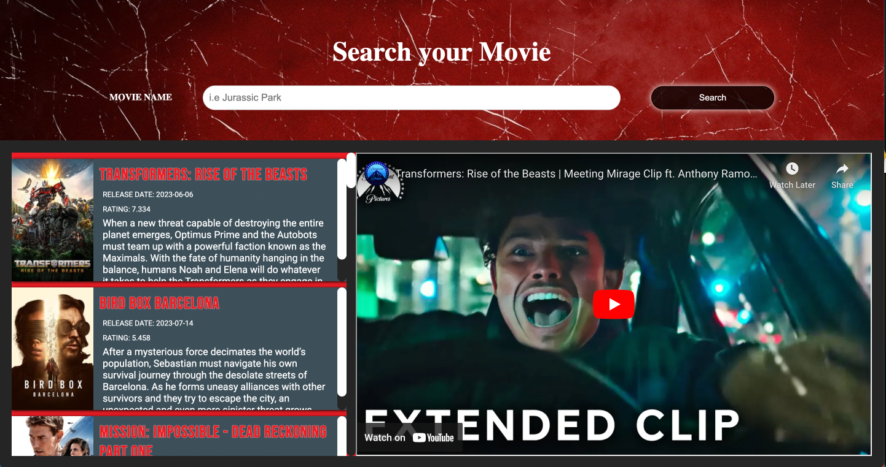

React Movie Search Engine 🎬
A fast and modern movie search application built with React, utilizing The Movie Database (TMDb) API to provide users with a comprehensive movie search experience.

Live Demo
Check out the live deployment of the application here:

Live Application: https://react-movies-search-alpha.vercel.app

Features
Movie Search: Quickly search for any movie by title using the search bar.

API Integration: Fetches real-time movie data, posters, and details from the powerful TMDb API.

Display Results: Shows a list of relevant movie results with key information.

Responsive Design: Optimized for a seamless experience across desktop and mobile devices.

Technologies Used
This project is primarily built using the following technologies:

Frontend: React.js

Styling: CSS

Data Source: The Movie Database (TMDb) API

Language: JavaScript (HTML structure)

Installation and Setup
Follow these steps to get a local copy of the project running on your machine.

Prerequisites
You must have Node.js and npm (or Yarn) installed on your computer.

1. Clone the Repository
Bash

git clone https://github.com/fabriciocunhauk/React-Movies-Search.git
cd React-Movies-Search
2. Install Dependencies
Use your preferred package manager to install the necessary packages:

Bash

# Using npm
npm install

# Or using Yarn
yarn install
3. Configure the TMDb API Key
Get an API Key: Sign up for an account on The Movie Database (TMDb) website and generate a new API key.

Create .env file: In the root directory of the project, create a file named .env.

Add the key: Add your API key to the .env file in the following format:

REACT_APP_TMDB_API_KEY=YOUR_API_KEY_HERE
Replace YOUR_API_KEY_HERE with the key you obtained from TMDb.

4. Run the Application
Start the development server:

Bash

# Using npm
npm start

# Or using Yarn
yarn start
The application should now be running in your browser, typically at http://localhost:3000.

Usage
Open the application in your web browser.

Use the main search bar to type the name of the movie you are looking for.

Press the Enter key or click the search button.

The application will display the search results fetched from TMDb.

Contributing
Contributions are always welcome! If you have any suggestions, bug fixes, or new features to propose, please feel free to:

Fork the repository.

Create your feature branch (git checkout -b feature/AmazingFeature).

Commit your changes (git commit -m 'Add some AmazingFeature').

Push to the branch (git push origin feature/AmazingFeature).

Open a Pull Request.

License
This project is licensed under the MIT License - see the LICENSE file for details (if one exists in the repository).

Contact
Project Link: https://github.com/fabriciocunhauk/React-Movies-Search

Developer: Fabricio Cunha
